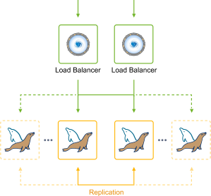
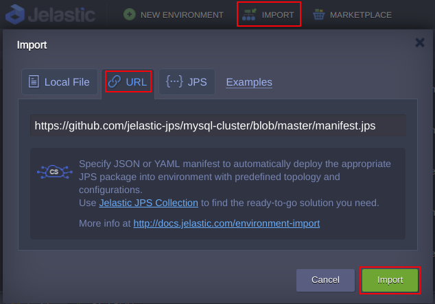
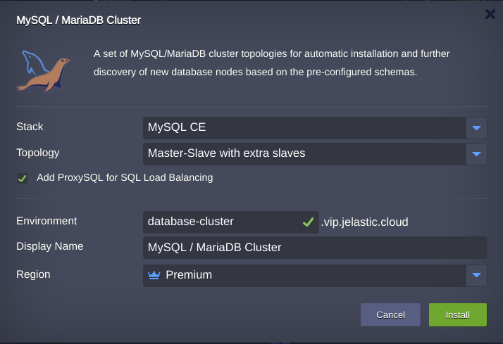

 

## MariaDB/MySQL Auto-Сlustering with Embedded Load Balancing and Replication Types Selection

MariaDB/MySQL Auto-Clustering solution is packaged as an advanced highly available and auto-scalable cluster on top of managed Jelastic dockerized stack templates.

 

The package includes Highly Available [*ProxySQL Load Balancer*](http://www.proxysql.com) and [*Cluster Orchestrator*](https://github.com/github/orchestrator) to manage MariaDB/MySQL replication topology. And there is a choice between different MariaDB/MySQL replication types:

## Simple MariaDB/MySQL Replication

* *primary*-*secondary*(*source*-*replica*) - provides a good consistency (i.e. exactly one node to modify data), but no automatic failover upon primary failure. Secondaries can be read without impact on primary. This topology is previously known as *master-slave*
* *primary*-*primary*(*source*-*source*) - operates with two primary nodes simultaneously, while other instances are configured as secondaries. This topology is previously known as *master-master*

## MariaDB Galera Cluster

[MariaDB Galera Cluster](https://mariadb.com/kb/en/library/what-is-mariadb-galera-cluster/) is a type of multi-primary synchronous replication which is performed at a transaction commit time, by broadcasting transaction write set to all cluster nodes for applying with the following benefits:

* No secondary lag
* No lost transactions
* Both read and write scalability
* Smaller client latencies

## Cluster Horizontal Scaling

The topologies *primary*-*secondary* or *primary*-*primary* are improved with a new horizontal scaling algorithm. The key idea of that is a new cluster member is created via cloning an existing *secondary* node. Right after the cloning procedure is completed the database on the new cluster member catches up data via binlog replay which definitely will be pretty short in time and guarantees the binlog will not expire unlike the case when the newly added node was created from scratch. Following this improvement we may guarantee cluster fast scaling with no inconsistencies that could arise since the binlog may be overwritten or expire during database cluster lifecycle before cloning. 

## Deployment to the Cloud

To get started, log in to Jelastic dashboard, import the required manifest using the link from GitHub:
[https://github.com/jelastic-jps/mysql-cluster/blob/master/manifest.jps](https://github.com/jelastic-jps/mysql-cluster/blob/master/manifest.jps)

Or you can click the **Deploy to Jelastic** button, specify your email address within the widget, choose one of the [Jelastic Public Cloud](https://jelastic.cloud/) providers and press **Install**.

**Note:** If you are already registered at Jelastic, you can deploy this cluster from Marketplace.

## Installation Process

In the opened confirmation window at Jelastic dashboard, choose MariaDB/MySQL replication type with appropriate cluster topology, state the *Environment* name, optionally, customize its [Display Name](https://docs.jelastic.com/environment-aliases). If required you may exclude ProxySQL layer from the cluster topology before installation, just uncheck it. Keep in mind that you won’t be able to do that later and vice versa if you disable it before installation you will not be able to add the proxy layer afterward.Then, select the preferable [region](https://docs.jelastic.com/environment-regions) (if several are available) and click on **Install**.

After successful installation, you’ll receive a number of default emails based on your environment topology with access credentials.

## MariaDB/MySQL Managed Hosting Business

To start offering this solution to your customers please follow to [Auto-Scalable Clusters for Managed Cloud Business](https://jelastic.com/apaas/)

