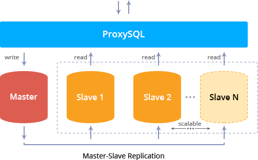

# Scalable MySQL Cluster with Load Balancing

The JPS package to deploy a ready-to-go scalable MySQL cluster with asynchronous master-slave DB replication, embedded Orchestrator GUI and ProxySQL load balancer.

## Scalable MySQL Cluster Package Specifics

The **Scalable MySQL Cluster with Load Balancing** package can be installed in just one-click to create a Docker-based environment with the following topology specifics:
- by default, includes 1 ProxySQL load balancer node (based on _jelastic/proxysql_ image) and a pair of MySQL database servers (built over the  _[jelastic/mysql](https://hub.docker.com/r/jelastic/mysql/):5.7-latest_ template) with asynchronous replication between them
- one MySQL container is assigned a _master_ role, whilst the second one (and all the further manually added nodes) will serve as _slave_
- each container is assigned the default 8-cloudlet limit (equals to _1 GiB_ of RAM and _3.2 GHz_ of CPU) for [automatic vertical scaling](https://docs.jelastic.com/automatic-vertical-scaling)
- additional connection security is ensured with [Jelastic SSL](https://docs.jelastic.com/jelastic-ssl) being enabled out-of-box

Being delivered with a set of special preconfigurations, the current Scalable MySQL Cluster solution ensures the following distinguishing features and benefits :
- _**efficient load balancing**_ - ProxySQL uses the _hostgroups_ concept to separate DB master (with read-write possibility) and slaves (with read-only permissions); herewith, due to special _query rules_, all _select_ requests are redirected only to slave servers and distributed between them with round-robin algorithm to ensure even load
- _**re-configuration with no downtime**_ - a cluster is designed to run continuously and can be adjusted on a fly without the necessity to restart the running services
- _**automated failover**_ - slaves with high latency or the ones that can not be reached are automatically temporarily excluded from a cluster and re-added once the connection is restored
- _**comfortable GUI**_ - the solution includes pre-installed [Orchestrator](https://github.com/github/orchestrator) tool to simplify cluster management
- _**scalability and autodiscovery**_ - new MySQL nodes, added during manual  DB server [horizontal scaling](https://docs.jelastic.com/multi-nodes), are included into a cluster as _slaves_ with all the required adjustments being applied automatically

## How to Install MySQL Cluster into Jelastic Cloud

Deployment of the current **Scalable MySQL Cluster** solution represents a completely automated process, allowing to deploy a dedicated database cluster in a matter of minutes. In case you don’t have Jelastic account yet, click the button below and provide your email within the opened page. Next, choose the prefered [Jelastic Public Cloud](https://jelastic.cloud/), where you’ll be automatically registered and the package installation will be started.

Alternatively, if already registered at Jelastic, log into your account and [import](https://docs.jelastic.com/environment-import) the _**manifest.jps**_ file from above. Also, you can find this solution in [Jelastic Marketplace](https://docs.jelastic.com/marketplace).

Within the opened installation frame, you can provide desired _Environment_ name, _Display Name_ ([alias](https://docs.jelastic.com/environment-aliases)) and _[Region](https://docs.jelastic.com/environment-regions)_ (if several ones are available).

Click **Install** and wait a minute for Jelastic to configure everything for you.

Now, you can access cluster via the in-built _Orchestrator_ tool by clicking the **Open in browser** button within the appeared pop up or connect to the _PHPMyAdmin_ panel with the provided link.

## Management Information

After successful installation, you’ll receive the following email notifications with important administrating information on your MySQL cluster:
- **Scalable Database Cluster** - provides access data to PHPMyAdmin panel for managing databases
- **Database Auto Replication** - displays cluster connection information to bind your application with database
- **Orchestrator Configuration** - gives credentials to access the _Orchestrator_ panel for convenient cluster management
