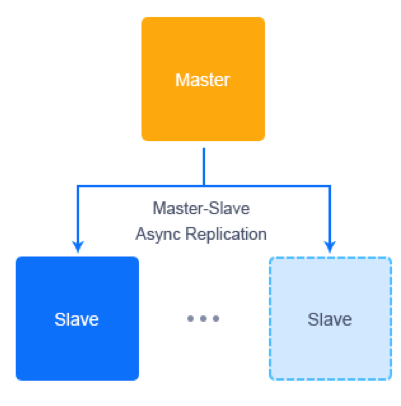

# MySQL Auto-Сlustering with Embedded Load Balancing and Replication Types Selection

MySQL Auto-Clustering solution is packaged as an advanced highly available and auto-scalable cluster on top of managed Jelastic dockerized stack templates with the following topology:

The package includes [*ProxySQL Load Balancer*](http://www.proxysql.com) and [*Cluster Orchestrator*](https://github.com/github/orchestrator) to manage MySQL replication topology and gain high availability. And there is a choice between different MySQL replication types:

## Simple MySQL Replication

* ***master-slave*** - provides a good consistency (i.e. exactly one node to modify data), but no automatic failover upon master failure. Slaves can be read without impact on master.
* ***master-master*** - operates with two master nodes simultaneously, while other instances are configured as slaves.

## MySQL Group Replication (MGR)

[MySQL group replication](https://dev.mysql.com/doc/refman/5.7/en/group-replication.html) provides benefits of the elastic, highly-available and fault-tolerant topology, which do come with some (relatively low) performance costs compared to the *simple replication*.

* ***single-primary group*** - a group of replicated servers with an automatic primary election, i.e. only one node accepts the data updates at a time
* ***multi-primary group*** - solution allows all servers to accept the updates (all nodes are primaries with the read-write permissions)

## Deployment to the Cloud

Click the **Deploy** button below, specify your email address within the widget, choose one of the [Jelastic Public Cloud Providers](https://jelastic.com/install-application/?manifest=https://raw.githubusercontent.com/jelastic-jps/wordpress-cluster/master/manifest.jps&keys=app.jelastic.eapps.com;app.cloud.hostnet.nl;app.jelastichosting.nl;app.appengine.flow.ch;app.jelasticlw.com.br;app.mircloud.host;app.jcs.opusinteractive.io;app.paas.quarinet.eu) and press **Install**.

## Deployment

In order to get this solution instantly deployed, click the **Deploy to Jelastic** button, specify your email address within the widget, choose one of the [Jelastic Public Cloud providers](https://jelastic.cloud) and press **Install**.

**Note:** If you are already registered at Jelastic, you can deploy this cluster from Marketplace.

## Installation Process

In the opened confirmation window at Jelastic dashboard, choose MySQL replication type with appropriate cluster topology, type the *Environment* name, optionally, customize its [Display Name](https://docs.jelastic.com/environment-aliases). Then, select the preferable [region](https://docs.jelastic.com/environment-regions) (if several are available) and click on **Install**.

After successful installation, you’ll receive a number of default emails based on your environment topology with access credentials.

## MySQL Managed Hosting Business

To start offering this solution to your customers please follow to [Auto-Scalable Clusters for Managed Cloud Business](https://jelastic.com/apaas/)

