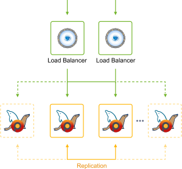
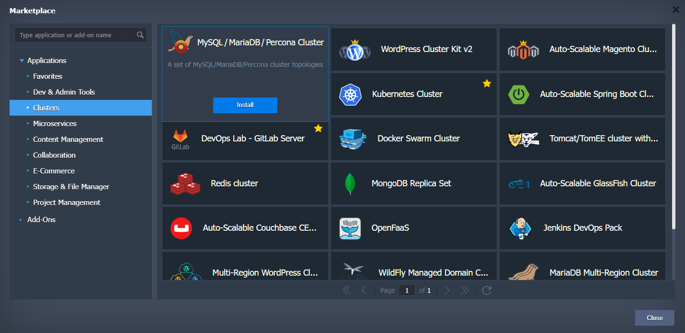
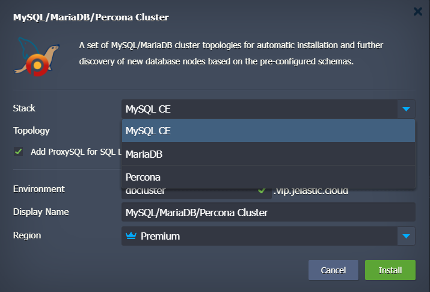

 

## MySQL/MariaDB/Percona Auto-Сlustering with Embedded Load Balancing and Replication Types Selection

MySQL/MariaDB/Percona Auto-Clustering solution is packaged as an advanced highly available and auto-scalable cluster on top of managed dockerized stack templates.

 

The package includes Highly Available [*ProxySQL Load Balancer*](http://www.proxysql.com) and [*Cluster Orchestrator*](https://github.com/github/orchestrator) to manage MySQL/MariaDB/Percona replication topology. And there is a choice between different MySQL/MariaDB/Percona replication types:

## Simple MySQL/MariaDB/Percona Replication

* *primary*-*secondary*(*source*-*replica*) - provides a good consistency (i.e. exactly one node to modify data), but no automatic failover upon primary failure. Secondaries can be read without impact on primary. This topology is previously known as *master-slave*
* *primary*-*primary*(*source*-*source*) - operates with two primary nodes simultaneously, while other instances are configured as secondaries. This topology is previously known as *master-master*

## MariaDB Galera Cluster

[MariaDB Galera Cluster](https://mariadb.com/kb/en/library/what-is-mariadb-galera-cluster/) is a type of multi-master synchronous replication which is performed at a transaction commit time, by broadcasting transaction write set to all cluster nodes for applying with the following benefits:

* No secondary lag
* No lost transactions
* Both read and write scalability
* Smaller client latencies

## Percona XtraDB Cluster

[Percona XtraDB Cluster](https://www.percona.com/software/mysql-database/percona-xtradb-cluster) (PXC) is a solution for high availability and scalability for MySQL clustering. In a nutshell, it is the Percona implementation of Galera Cluster for MySQL. PXC comes with XtraDB storage engine (a drop-in replacement of InnoDB) and follows the upstream Oracle MySQL releases very closely with the following benefits:

* No secondary lag
* No lost transactions
* Both read and write scalability
* Smaller client latencies

## Deployment to the Cloud

To get started, you can click the **Deploy to Cloud** button, specify your email address within the widget, choose one of the [Virtuozzo Public Cloud Providers](https://www.virtuozzo.com/application-platform-partners/) providers and press **Install**.

If you are already registered at Virtuozzo Application Platform(VAP), you can deploy this cluster from Marketplace.

 

 

## Installation Process

In the opened confirmation window at VAP dashboard, choose MariaDB/MySQL/Percona replication type with appropriate cluster topology, state the *Environment* name, optionally, customize its [Display Name](https://docs.jelastic.com/environment-aliases). Then, select the preferable [region](https://docs.jelastic.com/environment-regions) (if several are available) and click on **Install**.

After successful installation, you’ll receive a number of default emails based on your environment topology with access credentials.

## MySQL/MariaDB/Percona Managed Hosting Business

To start offering this solution to your customers please follow to [Auto-Scalable Clusters for Managed Cloud Business](https://www.virtuozzo.com/application-platform/?referer=jelastic)

