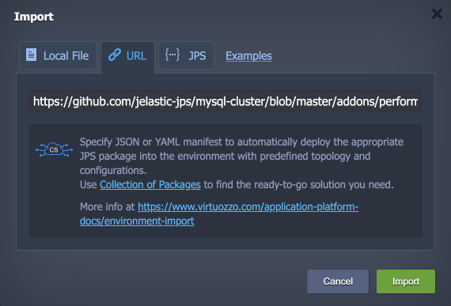
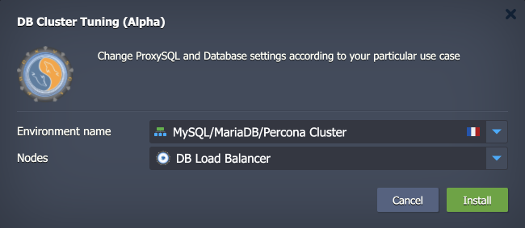
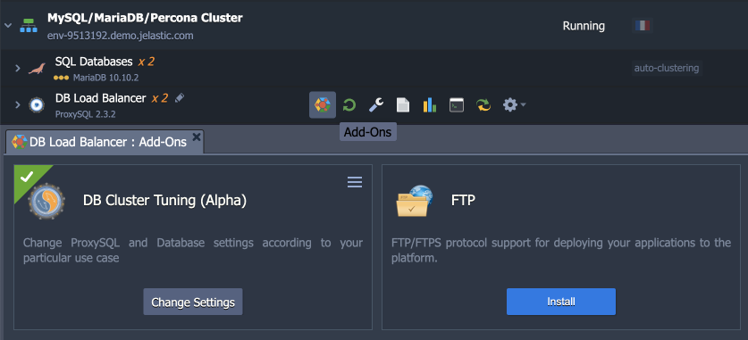
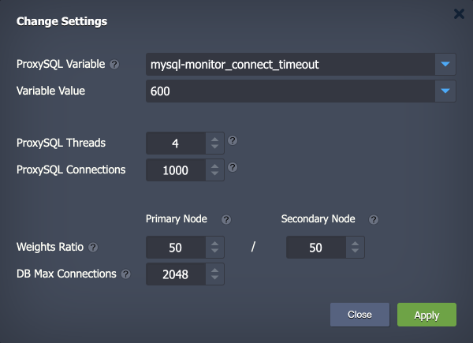

# Database Cluster Tuning Add-On

The default configurations of the MySQL/MariaDB/Percona database clusters are suitable for a limited number of cases only. If you want to achieve the best performance from your cluster, personalized optimizations are needed.

The tuning add-on is designed to optimize the performance of the MySQL/MariaDB/Percona Clusters that work with ProxySQL as a database load balancer. It provides automation to change the most crucial database parameters, ProxySQL configuration files, and variables to boost overall performance. Add-on's UI will make the process quick and convenient for the database administrators.

> Take into consideration that database cluster performance is a complex procedure that evaluates multiple factors, and only a few of them can be solved with the add-on. Check the **Performance Tuning** section below for more information.


## Performance Tuning

There are multiple factors that can affect the database cluster performance. We’ve categorized the most common and impactful tips on performance tuning into two major areas:

### System Performance Tuning

- Balance four main ***hardware resources***:
  - **Storage**. Take a moment to evaluate your storage. If you’re using traditional hard disk drives (HDD), you can upgrade to solid-state drives (SSD) for significant performance improvement.
  - **Processor**. Processors are usually considered the measure of how fast your system is.
  - **Memory**. Memory represents the total amount of RAM in your database storage server.
  - **Network**. It is important to monitor network traffic to ensure you have sufficient infrastructure to handle the load.
- Use ***InnoDB*** instead of *MyISAM*. It offers better performance with large volumes of data and a higher writing speed with rollbacks and commits.
- Use the ***latest version*** of MySQL/MariaDB/Percona. As the stacks are constantly developed, new optimization, performance, and security features are released regularly.

### Software Performance Tuning

SQL performance tuning is the process of maximizing query speeds on a relational database. The task usually involves multiple tools and techniques, like:

- Tweaking the database configuration files.
- Writing more efficient database queries.
- Structuring the database to retrieve data more efficiently.

> **Note:** When adjusting configuration settings, it’s best practice to make small incremental changes. A major adjustment may overburden another value and degrade performance. Also, it is recommended that you make one change at a time and then test. It’s easier to track errors or misconfigurations when you only change one variable at a time.

In general, the software performance optimization tips are:

- Optimize queries.
- Use indexes where appropriate.
- Avoid using a function in the predicate of a query.
- Avoid % wildcard in a predicate.
- Specify columns in the SELECT functions.
- Use ORDER BY appropriately.
- JOIN, WHERE, UNION, DISTINCT. Try to use an inner join whenever possible.
- Use the EXPLAIN function.
- **Database Server Configuration**. It involves changes to the */etc/mysql/my.cnf* file and database variables.
- **ProxySQL Server Configuration**. It involves changes to Global Variables and database server variables.

Only the two last points can be adjusted by the add-on to increase database cluster performance. Other tips are dependent on clients' actions on database and query optimization.


## Add-On Installation

The add-on can be installed on top of the [MySQL/MariaDB/Percona cluster](https://www.virtuozzo.com/application-platform-docs/db-auto-clustering/) with ProxySQL. The appropriate environment should be already installed on your Virtuozzo Application Platform account.

1\. [Import](https://www.virtuozzo.com/application-platform-docs/environment-import/) the add-on using a link to the ***manifest*** file in this repository:

```
https://cdn.jsdelivr.net/gh/jelastic-jps/mysql-cluster@master/addons/performance-tuning/manifest.yml
```



Click **Import** to proceed.

2\. Within the opened window, choose the target environment and select the ProxySQL nodes layer.



Click **Install** to add the add-on.

3\. Once completed, you can find the add-on under the corresponding tab for the ProxySQL layer.



4\. Click the **Change Settings** button and provide the following parameters:

- **ProxySQL Variables** – lists global variables that can tweak the behavior of ProxySQL. There are two types of global variables:
  - **admin** - control the behavior of the admin interface (starts with the "*admin-*" prefix)
  - **mysql** - control the MySQL functionality of the proxy (starts with the "*mysql-*" prefix)
- **Variable Value** – allows providing a custom value for the currently selected variable
- **ProxySQL Threads** - sets the number of background threads to process MySQL traffic
- **ProxySQL Connections** – sets the pool of cached connections that can be reused when future requests to the database are required
- **Weights Ratio** – sets the probability of the servers to be selected for the *Select* requests. The greater the weight of a server relative to others, the higher chance of the server being selected (ProxySQL default load-balancing algorithm is random-weighted)
- **DB Max Connections** – sets the maximum number of allowed connections to the database nodes



Provide the necessary adjustments and click **Apply** when ready. In a moment, new values will be applied to your database cluster.