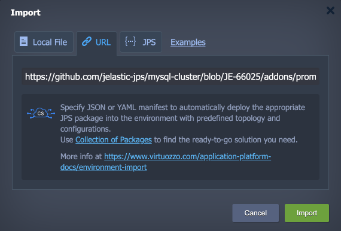
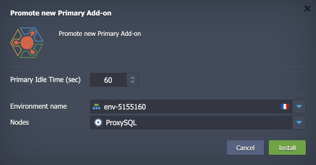
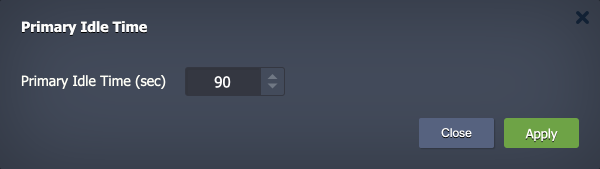
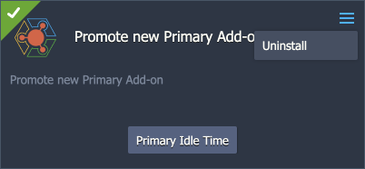
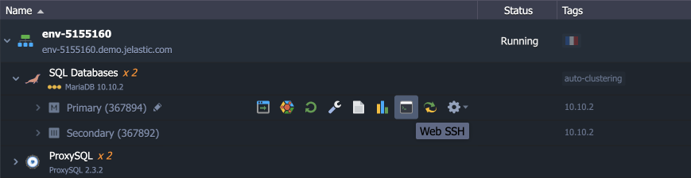
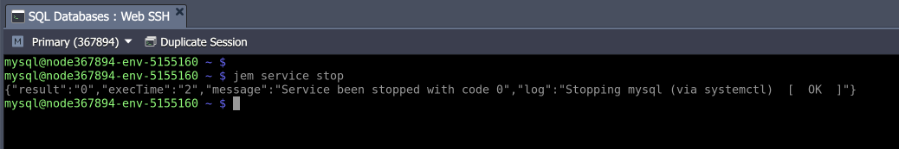
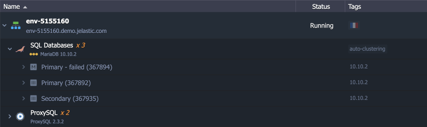
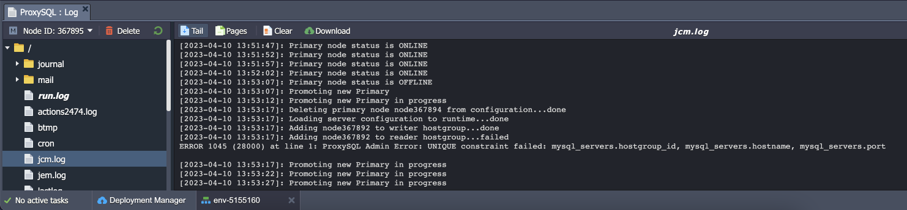

<p align="center"></p>

# MySQL/MariaDB Primary-Secondary Auto-Failover Add-On

The add-on is aimed to complement the MySQL/MariaDB Primary-Secondary implementation by handling its main flaw - no automatic failover upon primary failure. As a result, you get the consistency of the Primary-Secondary scheme (i.e. exactly one node to modify data) and simultaneously get auto-failover similar to Primary-Primary.


## Add-On Installation

The add-on is designed to work with the Virtuozzo Application Platform auto-clustering implementation of the [MySQL/MariaDB Primary-Secondary](https://www.virtuozzo.com/application-platform-docs/auto-clustering/#mysql) topology only. If you don’t have such an environment yet, you can install one directly via the dashboard:

1\. [Create a new environment](https://www.virtuozzo.com/application-platform-docs/setting-up-environment/). Select the **MySQL** or **MariaDB** node and enable the *Auto-Clustering* feature in the central part of the wizard. Ensure that the ***Primary-Secondary*** scheme is selected and the ***Add ProxySQL*** option is enabled.


Customize other settings up to your needs and click **Create**.

2\. [Import](https://www.virtuozzo.com/application-platform-docs/environment-import/) the add-on for auto-failover from this repository:

```
https://github.com/jelastic-jps/mysql-cluster/blob/JE-66025/addons/promote-new-primary/manifest.yml
```



3\. Select the target environment with the Primary-Secondary database cluster and ProxySQL nodes in the opened installation window. Optionally, you can adjust the timeout for the primary node (no less than *60* seconds), i.e. if not available for the stated period – a new primary will be promoted.



That’s all! The add-on will be installed in a few minutes.


## Add-On Configuration

After installation, you can find the add-on under the corresponding tab for the ProxySQL layer.


Here, you can adjust the **Primary Idle Time** period (no less than *60* seconds):



If the add-on is not needed anymore, it can be removed with the **Uninstall** button.




## Failover Testing

You can perform a quick failover testing after the add-on installation.

1\. Connect to the Primary node (marked in the dashboard) via [Web SSH](https://www.virtuozzo.com/application-platform-docs/web-ssh-client/).



2\. Stop the node with the following command:

```
jem service stop
```



3\. Wait for the timeout period. A new Primary will be promoted, and an additional Secondary database will be added automatically.



4\. You can also check the ProxySQL [logs](https://www.virtuozzo.com/application-platform-docs/view-log-files/) for more information.



As you can see, the Primary status is checked every five seconds. Once it is offline for the whole timeout period (one minute in our case), the new Primary is promoted.