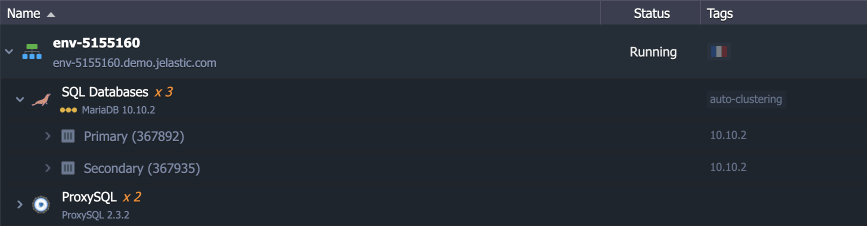

# Primary-Secondary Auto-Failover Add-On

The add-on is aimed to complement the MySQL/MariaDB/Percona Primary-Secondary implementation by handling its main flaw - no automatic failover upon primary failure. As a result, you get the consistency of the Primary-Secondary scheme (i.e. exactly one node to modify data) and simultaneously get auto-failover similar to Primary-Primary.


## Add-On Installation

The add-on is designed to work with the Virtuozzo Application Platform auto-clustering implementation of the [MySQL/MariaDB/Percona Primary-Secondary](https://www.virtuozzo.com/application-platform-docs/auto-clustering/#templates-with-supported-auto-clustering) topologies only. If you don’t have such an environment yet, you can install one directly via the dashboard:

1\. [Create a new environment](https://www.virtuozzo.com/application-platform-docs/setting-up-environment/). Select the **MySQL**, **MariaDB**, or **Percona** node and enable the *Auto-Clustering* feature in the central part of the wizard. Ensure that the ***Primary-Secondary*** scheme is selected and the ***Add ProxySQL*** option is enabled.


Customize other settings up to your needs and click **Create**.

2\. [Import](https://www.virtuozzo.com/application-platform-docs/environment-import/) the add-on for auto-failover from this repository:

```
https://cdn.jsdelivr.net/gh/jelastic-jps/mysql-cluster@master/addons/promote-new-primary/addon-with-proxysql.yml
```


Provide the following data to set up the add-on:

- **Primary Idle Time (sec)** - adjust the timeout for the primary node (no less than *30* seconds), i.e. if not available for the stated period – a new primary will be promoted
- **Endpoint to Primary DB** – add dynamic [endpoint](https://www.virtuozzo.com/application-platform-docs/endpoints/) for direct connection to the Primary database bypassing the ProxySQL node
- **Environment name** – choose an environment with the Primary-Secondary database cluster
- **Nodes** – select the ProxySQL layer within the target environment

That’s all! The add-on will be installed in a minute.


## Add-On Configuration

Installed add-on can be found under the corresponding tab for the ProxySQL layer.


Here, you can adjust the **Auto Failover** settings provided during the installation – change the *Primary Idle Time* period and add/remove *Endpoint to the Primary DB*.


The **Failover** button will simulate the Primary node failure to test failover procedure.

If the endpoint option was enabled during the installation/configuration, the connection link can be found in the **Endpoints** section of the environment settings.


You can remove the add-on with the **Uninstall** button, if not needed anymore.


## Failover Testing

You can perform a quick failover testing after the add-on installation. The straightforward approach would be to run failover from the add-on's configuration (the **Failover** button).


> Alternatively, you can simulate a problem manually.
>
> 1\. Connect to the Primary node (marked in the dashboard) via [Web SSH](https://www.virtuozzo.com/application-platform-docs/web-ssh-client/).
>
> 
>
> 2\. Stop the node with the following command:
>
> ```
> jem service stop
> ```
>
> 
>
> 3\. Wait for the timeout period.

In this testing failover scenario, we simulate the Primary node failure. The following actions will be performed automatically to restore the cluster:

- old Primary is excluded from the cluster and removed
- old Secondary is promoted to a new Primary
- a new Secondary node is created and added to the cluster



You can also check the ProxySQL [logs](https://www.virtuozzo.com/application-platform-docs/view-log-files/) (***jcm.log***) for more information.


As you can see, the Primary status is checked every five seconds. Once it is offline for the whole timeout period (immediately if called via add-on's settings), the new Primary is promoted.

If you’ve added an endpoint, it will be automatically reconfigured to connect to the new Primary node. 