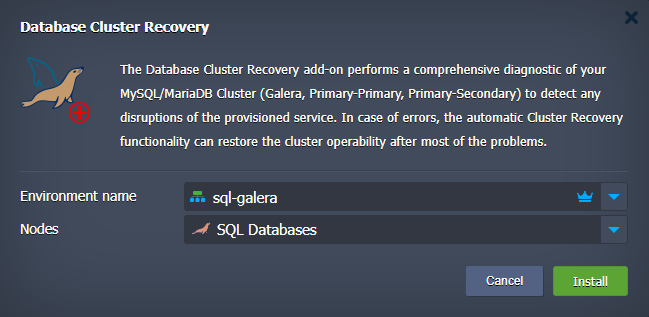
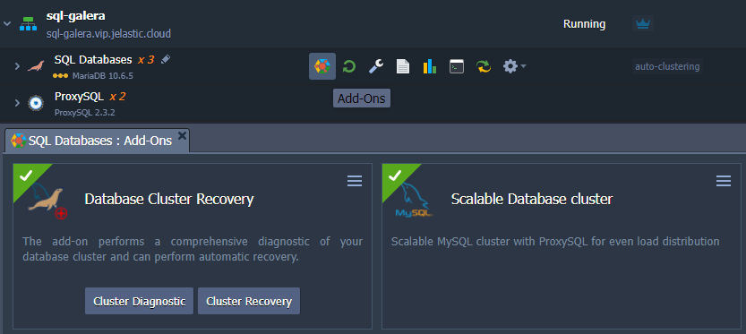

 

## Restore and Recovery Add-On for MariaDB/MySQL Clusters

The [MariaDB/MySQL Auto-Clustering](https://jelastic.com/blog/mysql-mariadb-database-auto-clustering-cloud-hosting/) solution is packaged as an advanced highly available and auto-scalable cluster on top of managed Jelastic dockerized stack templates. Once the database failed and becomes inaccessible you can use this automated solution for database restoration and even recovery of fully corrupted node.

The list of supported DB clusters for recovering:

 - Primary-Secondary Cluster based on MariaDB and MySQL stacks

 - Primary-Primary Cluster based on MariaDB and MySQL stacks

 - Galera Cluster based on MariaDB stack
 

With help of the add-on you can carry out cluster diagnostic and take a decision how to get database cluster back into operation. The diagnostic flow is based on:

 - getting the topology scheme (Primary-Secondary, Primary-Primary, Galera)  

 - getting the status of each node  

 - providing a recovery method related to scheme and status to the end user  

### Add-On Installtion 

The add-on can be installed either automatically along with database cluster installation or manually from [Marketplace](https://www.virtuozzo.com/application-platform-docs/marketplace/) of Virtuozzo Application Platform. It is considered that you have already an account on one of [Hosting Service Providers](https://www.virtuozzo.com/application-platform-partners/). So, if you have no add-on installed, sing in to the platform, open **Add-Ons** section in the Marketplace and pick **MySQL/MariaDB Cluster Recovery** add-On.

## Installation Process

In the opened confirmation window, choose Database Environment and respective database nodes, and click on **Install**.

After successful installation, the add-on will appear in the list of add-ons of sqldb layer. Now it is ready for utilization.

## Database Recovery How To

Add-on allows to do two actions:

 - **Cluster Diagnostic** - with this action the add-on automatically scans all nodes in the cluster in order to identify whether the nodes are accessible and databases are consistent or not. If during diagnostic the database corruption or even node failure will be detected, the add-on will warn you with respective popup window  
 

 
 - **Cluster Recovery** - once any failure has been detected you can either try to do automatic database recovery by pressing the **Cluster Recovery** button or to do manual database recovery following the link to the recovery guide. The best practice is to use automatic recovery scenario
 
To perform automatic recovery, provide database user credentials either you got upon database cluster installation or the credentials of another priviledged user you created.

In case the automatic recovery failed and you go with manual recovery flow, first take a look at **/var/log/db_recovery.log** file to get better understanding of a nature of detected error. Then you can try to do recovery yourself using our guide following the link in the **Information** window and official documentation from [MySQL](https://mysql.org)/[MariaDB](https://mariadb.org) teams. 

