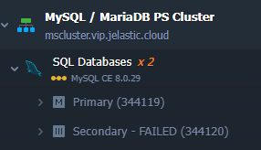
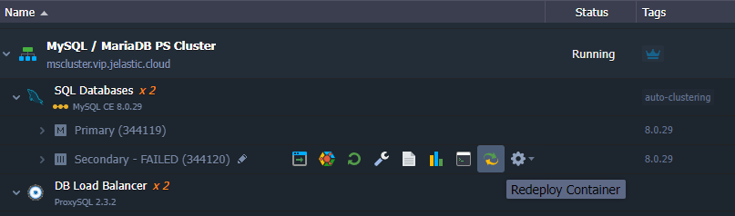
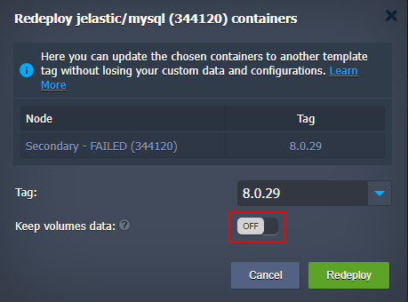
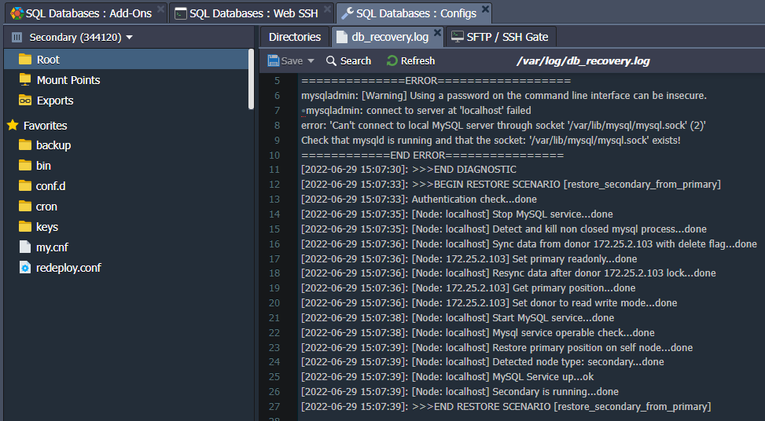
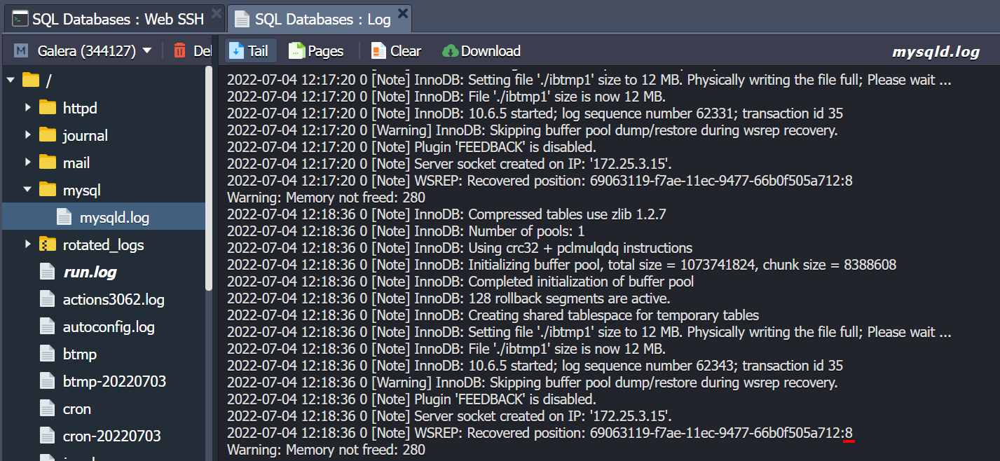
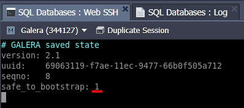

<p align="center"> 

</p>

## Manual Recovery Guide of Database Servers for MariaDB/MySQL Clusters

This guide is an addition to the automatic database recovery flow that is carried out using the [Database Cluster Recovery addon](https://cdn.jsdelivr.net/gh/jelastic-jps/mysql-cluster@master/addons/recovery) within Virtuozzo Appplication Platform. If the automatic recovery fails, the user can use this guide and try to restore the failed database server manually.
Supported topologies:
  - [MySQL/MariaDB Primary-Secondary](https://jelastic.com/blog/master-master-slave-replication-mysql-mariadb-auto-clustering/)
  - [MySQL/MariaDB Primary-Primary](https://jelastic.com/blog/master-master-slave-replication-mysql-mariadb-auto-clustering/)
  - [MariaDB Galera Cluster](https://jelastic.com/blog/mariadb-galera-cluster-replication/)

### Recovery Steps

#### Integrity of Configuration Files

Check whether _/etc/mysql/conf.d/\*.cnf_ is available or not on the node marked as **FAILED** after cluster diagnostic. For example:

<p align="left"> 

</p>

For the Primary-Secondary topology there should be a ***/etc/mysql/conf.d/master.cnf*** file on the Primary node and ***/etc/mysql/conf.d/slave.cnf*** file on the Secondary node. 

For example we have a topology:
	 
<p align="left"> 

</p>

Where the ***master.cnf*** for Primary node of the Primary-Secondary topology:
```
[mysqld]
server-id = 344119
binlog_format = mixed
log-bin = mysql-bin
log-slave-updates
expire_logs_days = 7
slave-skip-errors = 1062
relay-log = /var/lib/mysql/mysql-relay-bin
relay-log-index = /var/lib/mysql/mysql-relay-bin.index
replicate-wild-ignore-table = performance_schema.%
replicate-wild-ignore-table = information_schema.%
replicate-wild-ignore-table = mysql.%
read_only = 0
report_host = node344119
```

and ***slave.cnf*** for any Secondary node of the Primary-Secondary topology:
```
[mysqld]
server-id = 344120
log-slave-updates
relay-log = /var/lib/mysql/mysql-relay-bin
relay-log-index = /var/lib/mysql/mysql-relay-bin.index
replicate-wild-ignore-table = performance_schema.%
replicate-wild-ignore-table = information_schema.%
replicate-wild-ignore-table = mysql.%
read_only = 1
report_host = node344120
```

For the Primary-Primary topology each Primary node should contain ***master.cnf*** file that looks like:

```
[mysqld]
server-id = 344133
auto-increment-increment = 2
auto-increment-offset = 1
binlog_format = mixed
log-bin = mysql-bin
log-slave-updates
expire_logs_days = 7
slave-skip-errors = 1062
relay-log = /var/lib/mysql/mysql-relay-bin
relay-log-index = /var/lib/mysql/mysql-relay-bin.index
replicate-wild-ignore-table = performance_schema.%
replicate-wild-ignore-table = information_schema.%
replicate-wild-ignore-table = mysql.%
read_only = 0
report_host = node344133
```

For the Primary-Primary topology each Secondary node should contain the same  ***slave.cnf*** file as for Primary-Secondary topology.

For the Galera cluster replication topology each node contains ***/etc/mysql/conf.d/galera.cnf*** and looks as follows:

```
[mysqld]

server_id = 967

binlog_format = ROW
default-storage-engine = innodb
innodb_autoinc_lock_mode = 2

bind-address = node344128
report_host = node344128

# Galera Provider Configuration
wsrep_on = ON
wsrep_provider = /usr/lib64/galera/libgalera_smm.so
wsrep_slave_threads = 2

# Galera Cluster Configuration
wsrep_cluster_name = galera-galera
wsrep_cluster_address = gcomm://172.25.3.2,172.25.3.15,172.25.2.254
# wsrep_notify_cmd=/var/lib/jelastic/bin/wsrep-notify.sh

# Galera Node Configuration
wsrep_node_address = 172.25.2.254
wsrep_node_name = node344128
```


If mentioned files are OK just download them localy.

#### Container Redeploy

The next step is to do [Container redeploy](https://www.virtuozzo.com/application-platform-docs/container-redeploy/) for failed databaser server node.  This action will result in you having a clean database node.

<p align="left"> 

</p>

Once you invoked redeploy dialogue window, switch the **Keep volume data** toggle into **Off** position. It is required to make sure that the database server will be created from scratch.

<p align="left"> 

</p>

Make sure that the redeploy tag coincides with the tag of other database nodes in the cluster.

#### Container recovery

After successful redeployment check whether the mentioned above configuration files are available. If not, see the chapter below [Configuration file restoration](#configuration-file-restoration).

Then open [WebSSH](https://www.virtuozzo.com/application-platform-docs/web-ssh-client/) session and stop **mysql** service with command:

***sudo jem service stop***

After that, go to the Add-Ons tab, find the **Database Cluster Recovery Add-On** and press **Cluster Recovery** button.

<p align="left"> 

</p>

That's it, if you have successfull information window the databse cluster recovered just make sure the database can handle reads/writes operations properly.

<p align="left"> 

</p>

In case you are still experiencing probelms with database go and check ***/var/log/db-recovery.log*** file and apply to our support with it.

<p align="left"> 

</p> 


#### Configuration File Restoration

In case the configuration file is broken or even absent you can restore it either from file you downloaded at the first step of chapter [Integrity of Configuration Files](#integrity-of-configuration-files) or manually as described below.  

For the Primary-Secondary topology you can use the content of config files provided in this document. For other topologies you can just copy respective config file from a healthy node of the same role.

Then you must replace the nodeID and IP address with the correct ones that belong to your FAILED database server for the parameters depending on replication topology:

*Primary-Secondary* and *Primary-Primary*:  

 - server-id = 344119
 - report_host = node344133
 
*Galera*:  

 - bind-address = node344128
 - report_host = node344128
 - wsrep_node_address = 172.25.2.254
 - wsrep_node_name = node344128

### Cluster Recovery When All Nodes Fail

In case of all the nodes in the database cluster are failed it is not possible to recover cluster for the topologies:
  - MySQL/MariaDB Primary-Secondary
  - MySQL/MariaDB Primary-Primary  

In such a case you can re-create cluster from scratch using database backup if you have one.

But for Galera cluster you can try to follow three simple steps to get it back. Open WebSSH session on each cluster node and stop mariadb service:

***$ sudo jem service stop*** 

Then issue the command as follows on each cluster node in order to obtain **Recovered position** value:

***$ mysqld --wsrep-recover***

then go to the log file */var/log/mysql/mysqld.log* and get the value:

<p align="left"> 

</p>

In the example the value is **8**.
Compare the *Recovered position* on all nodes. The one with the highest value should be used for bootstrap. Once again, choose any node if multiple ones have the highest value. Next, set the **safe_to_bootstrap** variable to **1** in the ***/var/lib/mysql/grastate.dat*** file: 

***$ vim /var/lib/mysql/grastate.dat***

<p align="left"> 

</p>

and bootstrap from this node issuing command on each node one by one:

***$ sudo jem service start***

Thus cluster will be initialized from the node with the highest *Recovered postion*.
Press diagnostic button on the add-on to make sure the cluster got back into operation.
